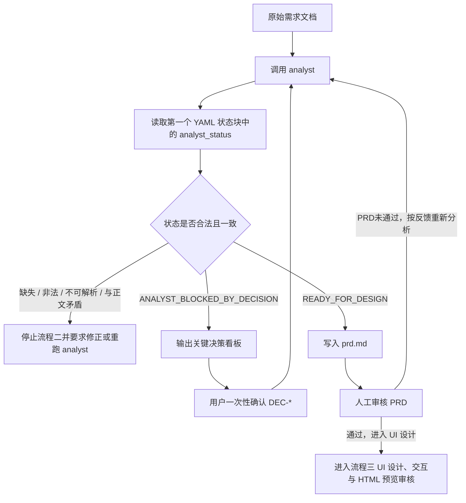

# Superlooper

Superlooper 是一个同时面向 Claude Code 与 Codex 的 AI 并行编排插件源码，用于把原始需求文档转换为 PRD、UI 设计与 HTML 预览、系统设计、项目结构初始化、模块拆分清单和执行 Manifest，并调度多个 agent 完成并行开发、审查、合并、测试、应用、受控变更回退和 PRD 反向校对闭环。

- 插件名称：`superlooper`
- 作者：`zh-miao`
- 组织：`DQ-wings`
- 许可证：`MIT`
- 版本事实源：`.claude-plugin/plugin.json` 与 `.codex-plugin/plugin.json`；版本说明：`CHANGELOG.md`
- 当前状态：双平台插件源码结构；Claude Code manifest 已通过 `claude plugin validate . --strict`

## 项目概述

本项目不是业务应用，而是可复用的 Claude Code 与 Codex 双平台插件源码。它的核心能力是把工程需求转化为可执行的多 agent 开发流程，并通过 `.superlooper/` 运行目录保存上下文、Manifest、模块产物、合并产物和报告。

### 核心能力

- 从原始需求文档生成结构化 PRD。
- 需求阶段输出机器可读状态，区分 `ANALYST_BLOCKED_BY_DECISION` 与 `READY_FOR_DESIGN`。
- 从 PRD 生成 UI 设计规格、交互流程和单文件 HTML 预览原型。
- UI 审核通过后，从 PRD 与 UI 产物生成系统设计、接口契约、数据模型和初始化建议。
- 默认 `standard` 模式通过上游自校对和 validator 自动完成设计、初始化、模块拆分和执行清单准备。
- `strict_review` 模式保留设计确认、初始化分类、初始化版本、模块拆分和执行清单逐阶段人工审核。
- 项目结构初始化完成后生成模块拆分清单。
- 根据初始化报告和模块拆分清单生成 `execution_manifest.json` 与执行摘要 `execution_summary.md`。
- 通过 `scripts/run_execution_dag.py` 读取 `execution_manifest.json`、计算节点依赖顺序并写入可校验的 DAG 节点状态。
- `scripts/run_execution_dag.py` 是 DAG state runner，只负责 DAG 结构核验、拓扑顺序和 `.dag.json` 状态记录；它不调度真实 subagent，不替代 `/superlooper:spl:run` 主协议中的 code review、merge、test、apply 和需求反向校对门禁。
- 模块拆分、Manifest payload、动态 agent 约束和报告 validator 贯通 UI traceability 与 `brownfield-selective` 存量项目边界字段。
- 使用插件静态 `agents/` 目录提供公共 agent 模板，其中 `agents/developer.md` 只作为动态 `module_*` 编码子代理模板。
- 运行时按模块生成实际执行编码的 `module_*` agent。
- 并行调度多个模块实现节点，并在执行前阻断跨模块 `target_files` 路径冲突。
- 在合并前执行代码质量与安全审查。
- 通过 `scripts/merge_artifacts.py` 合并模块产物。
- 在合并结果上执行集成测试与契约测试。
- 通过 `scripts/apply_to_workspace.py` 将通过测试的产物应用到目标项目根目录，并在 `apply_report.json` 中记录逐文件 `workspace_validation`。
- 生成 `session_report.md` 后调用 `agents/requirement-verifier.md` 反向校对 PRD，并等待用户确认最终交付。
- PRD 或设计审核未通过时保持 session 因果链，用户自然语言反馈先归一化为内部 canonical action，再重分析或重设计。
- 深层阶段需求或设计变更先归一化为影响分析动作，再调用 `agents/impact-analyzer.md` 生成 `change_impact_report.md`，经人工确认后才允许局部重跑。
- 终端会话中断后，用户输入“继续任务”等自然语言时沿 active session 恢复，不重新启动完整流程。

## Quick Start

### 安装产物选择

普通用户使用 `superlooper-<version>-install.zip` 安装 Superlooper。`superlooper-<version>-source.zip` 用于源码分发、审计和开发验证，不作为普通用户安装入口。

也可安装独立 marketplace 仓库：先在插件源码根目录执行 `python scripts/package_marketplace.py --target ../superAI-marketplace`，再将生成的 `../superAI-marketplace` 作为独立 GitHub repository 发布。target 必须位于插件源码目录外且尚不存在。生成树同时包含 Claude Code 的 `.claude-plugin/marketplace.json` 与 Codex 的 `.agents/plugins/marketplace.json`；两个 entry 都引用同一个相对路径 `./plugins/superlooper`。使用真实 Claude Code marketplace 安装时，依次执行：

```text
/plugin marketplace add <owner>/superAI-marketplace
/plugin install superlooper@superAI-marketplace
```

安装后在目标项目根目录执行 `/superlooper:spl:doctor`，再执行 `/superlooper:spl requirements.md [session_id]`。Claude Code 会按插件名 `superlooper` 添加命名空间；源码中的 `commands/spl*.md` 路径和 `/spl...` internal canonical key 不是用户直接输入的命令。

安装后进入目标项目根目录，运行：

```text
/superlooper:spl:doctor
```

`/superlooper:spl:doctor` 输出插件结构、脚本、schema、发布过滤自检结果。自检失败时，先修复插件安装或产物完整性，不启动业务流程。

### Codex 快速开始

在 Codex 中使用同一个已发布 Marketplace 时，依次执行：

```text
codex plugin marketplace add <owner>/superAI-marketplace --ref main
codex plugin add superlooper@superAI-marketplace
```

在目标项目根目录显式调用 Codex skills：

```text
$superlooper-doctor
$superlooper requirements.md [session_id]
```

在 Windows 的 non-ephemeral、`read-only` Codex parent session 中，`$superlooper-doctor` 需要该 shell 能执行共享脚本所需的 Python runtime。宿主 shell 能执行 Python 不足以证明该前置条件已满足：必须在将运行 doctor 的同一个 `read-only` Codex session 中先成功执行 `python --version`。Codex skill 从已加载 skill 文件所在目录的 `../../..` 推导安装态 `plugin_root`，并从 `<plugin_root>/scripts/doctor.py --workspace-root . --platform codex` 校验 Codex 结构；不得把 `scripts/doctor.py` 解释为目标工作区相对路径，也不依赖 `claude` CLI。若 Python runtime 不可用，不要通过 `danger-full-access`、全磁盘读取或全量环境变量继承绕过，也不要通过重启系统尝试修复；先按组织的 sandbox 策略满足运行环境前置条件，再运行 doctor。

Codex 的 `$` 是 skill 显式触发标记，不是 Claude Code slash command。升级使用 `codex plugin marketplace upgrade superAI-marketplace`；卸载依次使用 `codex plugin remove superlooper@superAI-marketplace` 和 `codex plugin marketplace remove superAI-marketplace`。完整的 Codex 安装、调用、更新和卸载说明见 [docs/CODEX.md](docs/CODEX.md)。

### 准备需求文档

在目标项目根目录准备一个已存在的原始需求文档，例如：

```text
requirements.md
```

该文档是 `/superlooper:spl` 七流程的输入。不要把需求正文直接写进命令参数。当前目录必须是目标项目根目录，不是插件源码目录。

### 启动首次会话

在目标项目根目录运行：

```text
/superlooper:spl requirements.md [session_id]
```

未提供 `session_id` 时，Superlooper 会生成安全 session ID。首次启动会创建 `.superlooper/context/<session_id>/`、`.superlooper/reports/<session_id>/` 和 `.superlooper/state/<session_id>.json`，并进入流程一入口与会话准备、流程二需求分析与 PRD 审核。

### 审核握手最短路径

| 阶段 | 产物 | 通过时回复 |
| --- | --- | --- |
| PRD 审核 | `.superlooper/context/<session_id>/prd.md` | `通过，进入 UI 设计` |
| UI 审核 | `.superlooper/context/<session_id>/ui/preview.html` 与 UI 规格 | `UI设计通过，进入系统设计` |
| 执行摘要审核 | `.superlooper/reports/<session_id>/execution_summary.md` | `按此执行` |
| strict_review 设计与清单审核 | `.superlooper/context/<session_id>/design/`、`module-split.json`、`execution_manifest.json` | `继续任务`、`生成执行清单`、`执行` 或 `开始并行开发` |
| 需求反向校对审核 | `.superlooper/reports/<session_id>/requirement_alignment_report.md` | `需求校对通过，完成交付` |

审核未通过时，直接输入自然语言反馈。Superlooper 会结合当前 session 和 phase 归一化为内部 canonical action，不要求重新运行完整 `/superlooper:spl`。

### 升级

使用新的 `superlooper-<version>-install.zip` 更新插件后，先在目标项目根目录运行：

```text
/superlooper:spl:doctor
```

旧 session 继续使用：

```text
/superlooper:spl:resume <session_id>
```

不要为了继续旧 session 重新运行完整 `/superlooper:spl requirements.md [session_id]`。

### 卸载

卸载插件本体不会自动清理目标项目中的 `.superlooper/` 或 `.claude/agents/generated/superlooper/`。清理这些运行时目录前，必须确认对应 session 不再需要恢复、审计或交付追溯。

### 恢复和状态查看

如果终端会话中断或需要继续当前任务，优先使用：

```text
/superlooper:spl:resume <session_id>
/superlooper:spl:status <session_id>
```

当目标项目中只有 1 个 active session，且用户在 `/superlooper:spl` 中输入“继续任务”“PRD 不符合”“UI 要调整”等自然语言反馈时，`/superlooper:spl` 必须优先沿该 active session 调用恢复语义，不得新建 session。存在多个 active session 时，必须先让用户选择 session。

### 常见失败处理

| 现象 | 处理方式 |
| --- | --- |
| 看不到 `/superlooper:spl` 或 `/superlooper:spl:doctor` | 重新检查 install artifact 安装位置，再运行 Claude Code plugin 校验。 |
| `/superlooper:spl:doctor` 失败 | 按自检输出修复插件结构、脚本编译、schema 或发布过滤问题；修复前不启动业务流程。 |
| `requirements.md` 不存在 | 在目标项目根目录创建真实需求文件后，再运行 `/superlooper:spl requirements.md [session_id]`。 |
| 存在多个 active session | 先运行 `/superlooper:spl:status <session_id>` 确认目标 session，再使用 `/superlooper:spl:resume <session_id>`。 |
| apply 冲突已人工处理 | 回复 `应用冲突已处理，重新应用`，只触发重新应用，不直接完成交付。 |

### 自检

运行：

```text
/superlooper:spl:doctor [session_id]
```

`/superlooper:spl:doctor` 只执行插件结构、脚本、schema、发布过滤和可选 session 契约自检，不推进业务流程。

### 入口边界

不提供 `/superlooper:spl:manifest`。执行清单生成归入 `/superlooper:spl:run`。

## 双平台入口与等价边界

| 语义入口 | Claude Code | Codex |
| --- | --- | --- |
| 总入口 | `/superlooper:spl <requirement_path> [session_id]` | `$superlooper <requirement_path> [session_id]` |
| PRD | `/superlooper:spl:prd <requirement_path> [session_id]` | `$superlooper-prd <requirement_path> [session_id]` |
| UI | `/superlooper:spl:ui <session_id>` | `$superlooper-ui <session_id>` |
| 设计 | `/superlooper:spl:design <session_id>` | `$superlooper-design <session_id>` |
| 执行 | `/superlooper:spl:run <session_id>` | `$superlooper-run <session_id>` |
| 状态 | `/superlooper:spl:status <session_id>` | `$superlooper-status <session_id>` |
| 恢复 | `/superlooper:spl:resume <session_id>` | `$superlooper-resume <session_id>` |
| 自检 | `/superlooper:spl:doctor [session_id]` | `$superlooper-doctor [session_id]` |

Superlooper 在 Claude Code 与 Codex 中保持等价的七流程、`.superlooper/` 状态、Manifest、报告和质量门禁；终端 UI、入口字符、模型措辞、token 消耗和并发时序不属于跨平台一致性承诺。

## 技术引用

| 类型 | 文件/目录 | 作用 |
| --- | --- | --- |
| Claude Code 插件清单 | `.claude-plugin/plugin.json` | 定义 Claude Code 插件名称、作者、许可证和组件路径 |
| Codex 插件清单 | `.codex-plugin/plugin.json` | 定义 Codex Agent Plugin 名称、版本、许可证和 Codex skills 路径 |
| Claude Code 运行入口 | `skills` 目录下的 `superlooper/SKILL.md` | 承载 Claude Code 主调度协议 |
| Codex 运行入口 | `codex/skills/*/SKILL.md` | 提供八个 `$superlooper...` skill 入口并复用共享 session 契约 |
| Codex dispatcher | `codex/dispatcher/README.md` | 声明从共享 Manifest 到 Codex 原生 `spawn_agent` 的调度边界 |
| 开发入口 | `skills` 目录下的 `superlooper-dev/SKILL.md` | 固化插件源码开发前必读上下文，减少每轮手动输入 |
| 静态 agent | `agents/*.md` | 定义需求、设计、影响分析、开发、审查、合并、测试、应用和 PRD 反向校对角色 |
| Slash commands | `commands/` | 提供 `/superlooper:spl`、`/superlooper:spl:prd`、`/superlooper:spl:ui`、`/superlooper:spl:design`、`/superlooper:spl:run`、`/superlooper:spl:status`、`/superlooper:spl:resume`、`/superlooper:spl:doctor` 用户入口；不提供 `/superlooper:spl:manifest` |
| 声明式交互配置 | `configs/interaction-flow.json` | 声明 `/spl` 系列内部 canonical key、阶段入口、推荐握手回复和别名映射；用户安装后调用 `/superlooper:spl` 系列，不提供 `/superlooper:spl:manifest` |
| Hooks 目录 | `hooks/` | 预留插件 hooks，当前仅保留骨架 |
| 可执行工具目录 | `bin/` | 提供 `bin/spl` 最小 CLI 路由，当前只转发 doctor 自检，不定义第二套业务协议 |
| 输出样式目录 | `output-styles/` | 预留 Claude Code 输出样式，当前仅保留骨架 |
| 主题目录 | `themes/` | 预留插件主题，当前仅保留骨架 |
| 监控目录 | `monitors/` | 预留 monitors 配置，当前仅保留骨架 |
| 契约 schema | `schemas/*.schema.json` | 描述模块拆分、执行 Manifest、产物 Manifest 的 JSON 结构 |
| 项目初始化 | `scripts/initialize_project_structure.py` | 在上游自校对通过后、正式模块拆分和编码前初始化最小项目结构 |
| 契约校验 | `scripts/validate_miao_contracts.py` | 校验 Manifest、DAG、agent 文件、模块产物声明、初始化报告、执行摘要、上游自校对报告、变更影响分析报告和需求反向校对报告 |
| DAG state runner | `scripts/run_execution_dag.py` | 只负责 DAG 结构核验、拓扑顺序和 `.dag.json` 状态记录；不调度真实 subagent，不替代 `/superlooper:spl:run` 主协议中的 code review、merge、test、apply 和需求反向校对门禁 |
| 执行摘要 | `scripts/build_execution_summary.py` | 汇总初始化、module-split、execution_manifest 和真实 `upstream_alignment.md` 自校对结果，生成默认执行前人工握手报告 |
| 产物合并 | `scripts/merge_artifacts.py` | 将模块产物合并到 `.superlooper/merged/<session_id>/` |
| 工作区应用 | `scripts/apply_to_workspace.py` | 将合并产物应用到目标项目根目录 |
| MCP 配置 | `.mcp.json` | 标准插件 MCP 配置位置，当前不作为核心插件能力 |
| LSP 配置 | `.lsp.json` | 标准插件 LSP 配置位置，当前为空对象 |
| 插件设置 | `settings.json` | 标准插件设置位置，当前为空对象 |
| 忽略规则 | `.gitignore` | 排除本地 Claude Code 上下文、运行时产物和缓存文件 |
| 开发说明 | `docs/DEVELOPMENT.md` | 约束后续 Claude Code 开发不偏离插件结构 |
| Agent 内部流程 | `docs/agent-flows/analyst-flow.md`、`docs/agent-flows/ui-architect-flow.md`、`docs/agent-flows/architect-flow.md` | 分别约束需求分析、UI 设计与系统设计的内部推演流程，不作为主调度入口 |
| 后续增强设计 | `docs/design/*.md` | 记录 DAG state runner、script 状态推进统一、UI 实现契约和 brownfield-selective 的已实施最小能力与未实施扩展边界，仅进入 source 分发，不进入普通用户 install artifact |

## 目录结构

```text
superlooper/
├── .claude-plugin/
│   └── plugin.json                 # Claude Code plugin manifest
├── .codex-plugin/
│   └── plugin.json                 # Codex Agent Plugin manifest
├── agents/                         # 插件静态 subagent 定义
│   ├── analyst.md
│   ├── architect.md
│   ├── ui-architect.md
│   ├── code-reviewer.md
│   ├── developer.md
│   ├── impact-analyzer.md
│   ├── requirement-verifier.md
│   ├── system_merger.md
│   ├── tester.md
│   └── workspace_applier.md
├── skills/
│   ├── superlooper/
│   │   └── SKILL.md                # 插件运行时主调度协议
│   └── superlooper-dev/
│       └── SKILL.md                # 插件源码开发入口
├── codex/                          # Codex skills 与 native dispatcher 适配层
│   ├── skills/
│   │   ├── superlooper/
│   │   ├── superlooper-prd/
│   │   ├── superlooper-ui/
│   │   ├── superlooper-design/
│   │   ├── superlooper-run/
│   │   ├── superlooper-status/
│   │   ├── superlooper-resume/
│   │   └── superlooper-doctor/
│   └── dispatcher/
│       └── README.md               # Codex native dispatch contract
├── commands/                       # /superlooper:spl 命令入口
│   ├── spl.md
│   └── spl/
│       ├── prd.md
│       ├── ui.md
│       ├── design.md
│       ├── run.md
│       ├── status.md
│       ├── resume.md
│       └── doctor.md
├── configs/                        # 声明式交互配置
│   └── interaction-flow.json
├── hooks/                          # 预留 hooks 目录
│   └── .gitkeep
├── bin/                            # 最小 CLI 路由目录
│   ├── .gitkeep
│   └── spl                         # 只转发 scripts/doctor.py，不定义新的调度协议
├── output-styles/                  # 预留输出样式目录
│   └── .gitkeep
├── themes/                         # 预留主题目录
│   └── .gitkeep
├── monitors/                       # 预留 monitors 目录
│   └── .gitkeep
├── scripts/                        # 契约校验、session、Manifest、合并、应用、自检与发布脚本
│   ├── apply_to_workspace.py
│   ├── build_execution_summary.py
│   ├── build_session_report.py
│   ├── build_release_archive.py
│   ├── create_session.py
│   ├── doctor.py
│   ├── generate_execution_manifest.py
│   ├── generate_runtime_agents.py
│   ├── initialize_project_structure.py
│   ├── merge_artifacts.py
│   ├── normalize_user_intent.py
│   ├── package_plugin.py
│   ├── run_execution_dag.py
│   ├── resume_session.py
│   ├── status_session.py
│   ├── update_session.py
│   └── validate_miao_contracts.py
├── schemas/                        # JSON Schema 契约
│   ├── artifact-manifest.schema.json
│   ├── execution-manifest.schema.json
│   ├── interaction-flow.schema.json
│   ├── module-split.schema.json
│   └── session-state.schema.json
├── docs/                           # 开发说明、发布说明、设计文档、agent 内部流程与示例需求
│   ├── DEVELOPMENT.md
│   ├── RELEASE.md
│   ├── design/
│   │   ├── dag-executor-design.md
│   │   ├── script-state-unification-design.md
│   │   ├── ui-implementation-contract-design.md
│   │   └── brownfield-selective-design.md
│   ├── agent-flows/
│   │   ├── analyst-flow.md
│   │   ├── ui-architect-flow.md
│   │   └── architect-flow.md
│   └── requirements/
├── settings.json                   # 插件设置占位，当前为空对象
├── .mcp.json                       # MCP 配置占位，当前不作为核心能力
├── .lsp.json                       # LSP 配置占位，当前为空对象
├── .gitignore                      # 排除本地上下文、运行时产物和缓存
├── LICENSE
├── CHANGELOG.md
└── README.md
```

运行时目录由插件在目标项目中生成：

```text
.superlooper/
├── context/<session_id>/
│   ├── prd.md
│   ├── ui/
│   │   ├── ui-spec.md
│   │   ├── page-map.md
│   │   ├── interaction-flow.md
│   │   ├── ui-handoff.md
│   │   └── preview.html
│   └── design/
├── manifests/<session_id>/
│   ├── module-split.json
│   └── execution_manifest.json
├── agents/<session_id>/
│   └── module_<module_id>.md
├── outputs/<session_id>/<module_id>/
│   └── artifact_manifest.json
├── merged/<session_id>/
├── test_workspace/<session_id>/
├── state/
│   ├── <session_id>.json
│   └── <session_id>.dag.json
├── events/
│   └── <session_id>.jsonl
└── reports/<session_id>/
    ├── initialization_report.json
    ├── initialization_conflict_report.json
    ├── upstream_alignment.md
    ├── execution_summary.md
    ├── execution_summary_feedback.md
    ├── prd_feedback.md
    ├── ui_feedback.md
    ├── design_feedback.md
    ├── change_feedback.md
    ├── change_impact_report.md
    ├── code_review_report.md
    ├── code_review_feedback.md
    ├── merge_report.json
    ├── conflict_report.json
    ├── test_report.md
    ├── test_feedback.md
    ├── apply_report.json
    ├── apply_conflict_report.json
    ├── session_report.md
    └── requirement_alignment_report.md
```

`update_session.py` 在成功写入 state 后会追加 `.superlooper/events/<session_id>.jsonl`，记录 phase、命令、生成文件、报告、下一步动作、UI 状态、反馈报告、影响分析报告、失效产物、回退目标、用户输入归一化结果和待用户选择项等观测字段，不写入密钥、token、环境变量或原始需求正文。

安装态脚本区分两个根目录：`plugin_root` 是插件源码或安装根，用于读取静态 `agents/`、`schemas/`、`configs/`、`commands/` 和 `scripts/`；`workspace_root` 是目标项目根，只用于写入 `.superlooper/` 与 `.claude/agents/generated/superlooper/<session_id>/` 运行时产物。README 中的 `python scripts/...` 命令均表示插件根内脚本；安装态由 `/superlooper:spl` 命令从插件根调用脚本，并把目标项目根作为 `--workspace-root` 参数传入。

## 常用命令

| 目的 | 命令 | 说明 |
| --- | --- | --- |
| 校验插件结构 | `claude plugin validate . --strict` | 严格校验当前目录是否符合 Claude Code plugin 结构 |
| 校验合并脚本语法 | `python -m py_compile scripts/merge_artifacts.py` | 确认合并脚本没有 Python 语法错误 |
| 校验契约脚本语法 | `python -m py_compile scripts/validate_miao_contracts.py` | 确认契约校验脚本没有 Python 语法错误 |
| 校验声明式交互 flow | `python scripts/validate_miao_contracts.py --workspace-root . --session-id session_dummy --scope interaction-flow` | 校验 `configs/interaction-flow.json`、公开命令文件映射、阶段入口、初始化选项、canonical action、别名映射和推荐握手回复覆盖 |
| 校验 UI 产物契约 | `python scripts/validate_miao_contracts.py --workspace-root <project-root> --session-id <session_id> --scope ui-artifacts` | 校验 UI 固定产物、`ui-spec.md` 状态块、`preview.html` 自包含约束和 `ui-handoff.md` architect 消费契约 |
| 校验应用脚本语法 | `python -m py_compile scripts/apply_to_workspace.py` | 确认工作区应用脚本没有 Python 语法错误 |
| 初始化项目结构 | `python scripts/initialize_project_structure.py --workspace-root <project-root> --session-id <session_id> --project-category springboot --project-version springboot-3.x --project-root .` | 在上游自校对通过后、模块拆分和执行清单生成前初始化最小项目结构 |
| 校验初始化报告 | `python scripts/validate_miao_contracts.py --workspace-root <project-root> --session-id <session_id> --scope initialization-report` | 校验 `.superlooper/reports/<session_id>/initialization_report.json` |
| 生成执行摘要 | `python scripts/build_execution_summary.py --workspace-root <project-root> --session-id <session_id>` | 读取初始化报告、模块拆分、执行清单和上游自校对报告，输出 `.superlooper/reports/<session_id>/execution_summary.md` |
| 运行 DAG state runner | `python scripts/run_execution_dag.py --workspace-root <project-root> --session-id <session_id>` | 读取 `.superlooper/manifests/<session_id>/execution_manifest.json`，输出 `.superlooper/state/<session_id>.dag.json` 并记录脚本事件；不执行真实 subagent 调度或质量门禁 |
| 校验 DAG 状态 | `python scripts/validate_miao_contracts.py --workspace-root <project-root> --session-id <session_id> --scope dag-state` | 校验 `.superlooper/state/<session_id>.dag.json` 的节点状态和总体状态 |
| 校验执行摘要 | `python scripts/validate_miao_contracts.py --workspace-root <project-root> --session-id <session_id> --scope execution-summary` | 校验 `.superlooper/reports/<session_id>/execution_summary.md` |
| 校验上游自校对报告 | `python scripts/validate_miao_contracts.py --workspace-root <project-root> --session-id <session_id> --scope upstream-alignment` | 校验 `.superlooper/reports/<session_id>/upstream_alignment.md` |
| 校验需求反向校对报告 | `python scripts/validate_miao_contracts.py --workspace-root <project-root> --session-id <session_id> --scope requirement-alignment-report` | 校验 `.superlooper/reports/<session_id>/requirement_alignment_report.md`，并轻量检查 UI 验收编号校对证据 |
| 校验变更影响分析报告 | `python scripts/validate_miao_contracts.py --workspace-root <project-root> --session-id <session_id> --scope change-impact-report` | 校验 `.superlooper/reports/<session_id>/change_impact_report.md` |
| 执行 doctor 自检 | `python scripts/doctor.py --workspace-root .` | 在项目根目录运行；插件结构、Python 编译、命令契约、发布过滤和 secret scan 从插件根检查，可选 session 契约使用目标项目根 |
| 通过 bin 路由 doctor | `python bin/spl doctor [session_id]` | 在项目根目录运行，只转发到 `scripts/doctor.py`，不创建新的 Superlooper 调度入口 |
| 生成 source 发布清单 | `python scripts/package_plugin.py --mode source` | 在项目根目录运行，保留 `tests/`，生成 `dist/superlooper-release-manifest.json` |
| 生成 install 发布清单 | `python scripts/package_plugin.py --mode install` | 在项目根目录运行，排除 `tests/`，生成仅安装分发所需的发布清单 |
| 生成 source 发布归档 | `python scripts/build_release_archive.py --mode source` | 在项目根目录运行，先生成 source manifest，再输出 `dist/superlooper-<version>-source.zip` |
| 生成 install 发布归档 | `python scripts/build_release_archive.py --mode install` | 在项目根目录运行，先生成 install manifest，再输出 `dist/superlooper-<version>-install.zip` |
| 生成 marketplace 发布树 | `python scripts/package_marketplace.py --target <marketplace-root> [--root <plugin-root>]` | 按 install manifest 把完整运行闭包复制到 `<marketplace-root>/plugins/superlooper/`，生成相对路径 marketplace manifest；target 必须不存在，且不能是插件根或其子目录 |
| 查看合并参数 | `python scripts/merge_artifacts.py --help` | 查看 `.superlooper` 目录、session 和 Manifest 参数 |
| 查看应用参数 | `python scripts/apply_to_workspace.py --help` | 查看合并产物应用参数；具体路径覆盖使用 `--overwrite-file <relative_path>`，全量修改文件覆盖使用 `--overwrite-existing` |
| 校验执行契约 | `python scripts/validate_miao_contracts.py --workspace-root <project-root> --session-id <session_id> --agents-dir agents --runtime-agents-dir .superlooper/agents/<session_id> --registered-agents-dir .claude/agents/generated/superlooper/<session_id>` | 校验 Manifest、DAG、静态 agent、动态 agent 注册入口、artifact manifest 和已存在报告；`--agents-dir agents` 相对插件根目录解析 |
| 校验代码审查报告 | `python scripts/validate_miao_contracts.py --workspace-root <project-root> --session-id <session_id> --scope code-review-report` | 校验 `code_review_report.md` 的机器状态、阻断计数和模块覆盖范围 |
| 校验测试报告 | `python scripts/validate_miao_contracts.py --workspace-root <project-root> --session-id <session_id> --scope test-report` | 校验 `test_report.md` 的机器状态、被测路径、合并报告路径和 UI 验收编号覆盖证据 |
| 校验应用报告 | `python scripts/validate_miao_contracts.py --workspace-root <project-root> --session-id <session_id> --scope apply-report` | 校验 `apply_report.json` 成功状态、`workspace_validation.status=PASS`，并阻断遗留 `apply_conflict_report.json` |

## Slash Commands

Superlooper 实体化命令统一使用 `/superlooper:spl` 前缀。普通自然语言代码修改请求不会自动启动完整七流程。

### 入口触发规则

用户不需要记忆固定句子。存在 active session 时，自然语言反馈先结合 session state、phase、`project_initialized` 和 `change_impact_report` 归一化为内部 canonical action；语义不明确时输出候选动作让用户选择，不自动重跑 `/superlooper:spl`。`/superlooper:spl` 总入口在创建新 session 前必须先检查 active session；单 active session 优先恢复，多 active session 必须要求用户选择。

| 类型 | 命令 | 是否推进业务流程 |
| --- | --- | --- |
| 总入口 | `/superlooper:spl <requirement_path> [session_id]` | 是，进入流程一和流程二 |
| 分段入口 | `/superlooper:spl:prd`、`/superlooper:spl:ui`、`/superlooper:spl:design`、`/superlooper:spl:run` | 是，按对应流程推进 |
| 状态入口 | `/superlooper:spl:status <session_id>` | 否，只读查看状态 |
| 恢复入口 | `/superlooper:spl:resume <session_id>` | 按 state 恢复，不跳过人工审核 |
| 自检入口 | `/superlooper:spl:doctor [session_id]` | 否，只执行自检 |

`configs/interaction-flow.json` 只声明公开命令、阶段握手状态、内部 canonical action 和别名映射，不作为触发规则来源。

### 命令清单

| 命令 | 说明 |
| --- | --- |
| `/superlooper:spl <requirement_path> [session_id]` | 总入口，创建 session 并进入流程一入口与会话准备、流程二需求分析与 PRD 审核。 |
| `/superlooper:spl:prd <requirement_path> [session_id]` | 只执行流程一入口与会话准备、流程二需求分析与 PRD 审核。 |
| `/superlooper:spl:ui <session_id>` | 只执行流程三 UI 设计、交互与 HTML 预览审核。 |
| `/superlooper:spl:design <session_id>` | 只执行流程四系统设计、自动初始化和初始化后模块拆分准备；`strict_review` 模式保留初始化握手。 |
| `/superlooper:spl:run <session_id>` | 执行流程五执行清单、动态 agent 与执行摘要准备，用户确认摘要后执行流程六和流程七。 |
| `/superlooper:spl:status <session_id>` | 查看 session 当前状态，不推进业务流程。 |
| `/superlooper:spl:resume <session_id>` | 从 session state 推导下一步并恢复，不跳过 PRD、UI、执行摘要和最终 PRD 反向校对审核。 |
| `/superlooper:spl:doctor [session_id]` | 执行插件结构、脚本、schema 和 session 自检，不推进业务流程。 |

不提供 `/superlooper:spl:manifest`。执行清单生成能力归入 `/superlooper:spl:run`。

## 编码规范

- 插件静态 agent 必须位于 `agents/<agent>.md`。
- 插件运行协议必须位于 `skills` 目录下的 `superlooper/SKILL.md`，不得依赖 plugin root 的 `CLAUDE.md`。
- `agents/developer.md` 是动态 `module_*` 编码子代理模板，不作为实际编码 agent 直接执行。
- 动态 `module_*` agent 的运行时源文件必须位于 `.superlooper/agents/<session_id>/<agent>.md`。
- Claude Code 平台的动态 `module_*` agent 注册入口位于 `.claude/agents/generated/superlooper/<session_id>/<agent>.md`；运行时源文件与该注册入口内容必须完全一致。
- Codex 平台不写入 Claude 注册目录；其 Manifest `context.platform_registration` 指向 `.superlooper/agents/<session_id>/codex-dispatch.json`，该 dispatcher 的节点必须与共享 Manifest DAG 完全一致。
- 动态 `module_*` agent 的正文必须包含 `Runtime Module Constraints` 约束块，字段固定为 `session_id`、`module_id`、`target_files`、`file_roles`、`requirement_refs`、`decision_refs`、`open_question_refs`、`acceptance_refs`、`ui_refs`、`interaction_refs`、`component_refs`、`ui_acceptance_refs`、`allowed_existing_files`、`forbidden_files`、`integration_points`、`test_commands`、`overwrite_policy`、`test_focus`、`forbidden_inputs`、`forbidden_outputs`。
- Manifest 中 `agent` 字段必须能在静态 agent 目录或当前平台的动态运行时注册物中找到对应 `<agent>.md`。
- `module-split.json` 的模块项可使用 `requirement_refs`、`decision_refs`、`open_question_refs`、`acceptance_refs`、`ui_refs`、`interaction_refs`、`component_refs`、`ui_acceptance_refs`、`allowed_existing_files`、`forbidden_files`、`integration_points`、`test_commands`、`overwrite_policy`、`test_focus`、`depends_on_modules` 承载设计阶段追溯、存量项目边界与测试关注点。
- validator 会从 `module-split.json.modules[].ui_acceptance_refs` 收集 UI 验收编号，并对 `test_report.md` 与 `requirement_alignment_report.md` 正文执行轻量证据行审计；该审计只检查编号与证据关键词，不替代人工 UI 审核或完整 Markdown AST 校验。
- `module_*` 节点只读取自己的 `payload`、设计上下文、`module-split.json` 中自己的模块对象、执行清单节点，以及 Manifest 下发到本模块的 `DEC-*` / `OPEN-*` 编号和默认处理方式，不读取原始需求文档、其他模块 payload 或其他模块输出目录。
- `brownfield-selective` 当前是模块级受控存量项目契约：`allowed_existing_files` 只约束模块允许声明修改的既有文件，`forbidden_files` 阻断禁止路径，`overwrite_policy` 固定为 `block_by_default`，不放宽 apply 默认冲突阻断；project profile 级 glob 策略和 `dependency_policy` 属于未实施扩展。
- 不同模块的 `target_files` 不得声明同一路径；同一模块内部的 `target_files` 也不得重复声明；重复路径必须在执行清单流程阻断，不得留到并行编码或合并阶段处理。
- `mod_*` 节点集合必须与 `module-split.json` 中的 `modules[].id` 集合一致，不得遗漏设计拆分模块，也不得新增未声明模块。
- `execution_manifest.json` 的 `context` 路径必须是安全相对路径，并与当前 `session_id` 的 `.superlooper` 运行目录一致。
- 生成 `execution_manifest.json` 前，session state 中 `project_initialized` 必须为 `true`，且 `initialization_report` 指向的报告必须存在。
- 若模块声明 `file_roles`，则 `file_roles[].path` 必须覆盖同模块全部 `target_files`，确保动态编码子代理能识别每个目标文件职责。
- `mod_*` 节点 payload 必须是 object，且必须包含 `session_id`、`module_id`、`module_payload`、`design_docs_path`、`project_profile_path`、`module_split_path`、`execution_manifest_path`、`output_dir`、`artifact_manifest_path`、`target_files`、`file_roles`、`requirement_refs`、`acceptance_refs`、`ui_refs`、`interaction_refs`、`component_refs`、`ui_acceptance_refs`、`allowed_existing_files`、`forbidden_files`、`integration_points`、`test_commands`、`overwrite_policy`、`test_focus`、`forbidden_inputs`、`forbidden_outputs` 等模块执行锚点。
- `mod_*` 节点 payload 中的 `session_id` 必须与当前会话一致，`module_id` 必须与节点 ID 去除 `mod_` 前缀后的模块 ID 一致，`design_docs_path`、`project_profile_path`、`module_split_path`、`execution_manifest_path`、`output_dir`、`artifact_manifest_path` 必须指向当前 `session_id` 与当前模块的默认运行路径。
- 动态 `module_*` 只写入自己的 `.superlooper/outputs/<session_id>/<module_id>/`，并且只产出当前模块 `target_files` 声明的目标项目根目录相对路径。
- `artifact_manifest.json` 中的 `agent` 必须等于 `module_<module_id>`，确保 Manifest 节点、动态 agent 和模块产物声明可追溯一致。
- `artifact_manifest.json` 的 `status` 必须为 `success` 才能进入 `code-reviewer` 和合并链路；`failed` 或 `blocked` 必须阻断后续流程。
- 当 `artifact_manifest.json.status` 为 `failed` 或 `blocked` 时，必须在 `verification.summary` 或 `notes` 说明失败或阻塞原因。
- 当 `artifact_manifest.json.status` 为 `success` 时，`verification.commands` 必须是非空数组，且 `verification.commands[].status` 不得为 `failed`；若存在 `skipped`，必须在 `verification.summary` 或 `notes` 说明原因。
- `artifact_manifest.json` 的 `produced_files[].path` 不得重复声明。
- `artifact_manifest.json` 的 `produced_files[].operation` 只允许 `create` 或 `modify`；当前合并与应用链路不支持 `delete`。
- 安全红线：禁止 SQL 拼接，禁止硬编码密码、密钥、令牌、连接串；所有外部输入进入鉴权、查询、文件、命令、模板渲染链路前必须校验。
- `requirement_alignment_report.md` 的第一个代码块必须为 YAML 状态块，`PASS` 时 `unmet_requirement_count` 与 `unchecked_acceptance_count` 必须为 `0`。
- `change_impact_report.md` 的第一个代码块必须为 YAML 状态块，且 `affected_artifacts`、`affected_modules`、`rollback_target_phase` 必须通过契约校验。
- 合并脚本只合并 `artifact_manifest.json` 声明的文件，未声明文件不得进入合并结果。

## 工作流程

Superlooper 当前采用七流程叙述。七流程是当前主调度协议的文档结构，所有步骤、握手、校验和门禁均以 `skills/superlooper/SKILL.md` 为准。

| 流程 | 说明 |
| --- | --- |
| 流程一：入口与会话准备 | 确认 session、需求输入、运行目录和 analyst 可用性。 |
| 流程二：需求分析与 PRD 审核 | 处理 analyst 状态、阻塞决策和 PRD 审核握手。 |
| 流程三：UI 设计、交互与 HTML 预览审核 | 输出 UI 设计规格、页面地图、交互流程、UI 交付说明和 preview HTML，并等待 UI 审核。 |
| 流程四：系统设计、初始化与模块拆分 | 读取已审核 PRD 和已审核 UI 产物，输出设计文档、项目画像和初始化建议；默认自动完成项目结构初始化和 module-split.json，strict_review 保留逐阶段审核。 |
| 流程五：执行清单与动态 agent 准备 | 初始化报告校验通过后生成 execution_manifest.json、动态 module_* agent 和 execution_summary.md。 |
| 流程六：模块实现与代码审查门禁 | 并行实现模块、校验 artifact，并执行 code-reviewer。 |
| 流程七：合并、测试、应用与交付报告 | 合并产物、执行测试、应用到工作区，生成 session report 和 PRD 反向校对报告，并等待最终交付确认。 |

1. 入口与会话准备：主调度器确认 `session_id`、读取原始需求文档、创建 `.superlooper/context/<session_id>/` 与 `.superlooper/reports/<session_id>/`，并检查 `agents/analyst.md` 是否可用。
2. 需求分析与 PRD 审核：`analyst` 读取原始需求文档；若存在外部阻塞关键决策，则输出关键决策看板并等待用户确认；若无阻塞决策，则输出 `.superlooper/context/<session_id>/prd.md` 并等待人工审核。
3. UI 设计、交互与 HTML 预览审核：`ui-architect` 读取已审核 PRD 和 `docs/agent-flows/ui-architect-flow.md`，输出 `.superlooper/context/<session_id>/ui/` 下的 UI 规格、页面地图、交互流程、UI 交付说明和 `preview.html`；UI 审核未通过时写入 `ui_feedback.md` 并按 `ui_revision` 重生成。
4. 系统设计、初始化与模块拆分：`architect` 读取已审核 PRD、已审核 UI 产物和 `docs/agent-flows/architect-flow.md`，先输出架构概览、技术选型、项目画像和 `initialization-advice.md`；`standard` 模式读取初始化建议并自动调用 `scripts/initialize_project_structure.py` 写入 `initialization_report.json`，再生成带模块级追溯字段的 `module-split.json`；`strict_review` 模式保留设计、初始化分类、初始化版本和模块拆分人工审核。
5. 执行清单与动态 agent 准备：主调度器先校验 `current_phase=run`、`project_initialized=true`、`initialization_report`、UI 已审核通过且 UI/设计固定产物存在，再基于模块拆分清单生成 `execution_manifest.json`、动态模块 agent 和 `execution_summary.md`，并等待用户回复 `按此执行`。
   - 生成 Manifest payload 时，主调度器优先消费 `module-split.json` 中的 `requirement_refs`、`decision_refs`、`open_question_refs`、`acceptance_refs`、`ui_refs`、`interaction_refs`、`component_refs`、`ui_acceptance_refs`、`allowed_existing_files`、`forbidden_files`、`integration_points`、`test_commands`、`overwrite_policy`、`test_focus`、`target_files` 和 `file_roles`。
   - 生成动态 `module_*` agent 时，主调度器复用 `agents/developer.md` 模板并改写 frontmatter `name`，同时在正文写入 `Runtime Module Constraints` 模块约束块，不得把模板本身作为实际编码 agent 调度。
   - 若多个模块声明相同 `target_files`，必须停止执行清单流程并返回设计结果调整模块边界。
6. 模块实现与代码审查门禁：多个 `module_*` agent 并行写入 `.superlooper/outputs/<session_id>/<module_id>/`，每个模块产物通过 `artifact_manifest.json` 支撑后续审查、合并、测试和应用；`code-reviewer` 审查所有模块产物，输出 `.superlooper/reports/<session_id>/code_review_report.md`；只有 `code_review_status=PASS` 且报告校验通过才能进入合并；若审查失败，用户回复 `代码审查未通过，返回修正` 后，`resume_session.py` 写入 `code_review_feedback.md`、保持 `rollback_target_phase=run`，并只回到模块修正与代码审查链路。
7. 合并、测试、应用与交付报告：`system_merger` 调用 `scripts/merge_artifacts.py`，只有 `merge_report.json` 的 `status=success` 才能进入测试；`tester` 以 `.superlooper/merged/<session_id>/` 为测试对象，只有 `test_status=PASS` 且测试报告校验通过才能进入应用；测试失败时，用户回复 `测试未通过，返回修正` 后写入 `test_feedback.md` 并回到 run 局部返工；`workspace_applier` 调用 `scripts/apply_to_workspace.py`，默认不覆盖已有差异文件，用户确认具体路径后使用 `--overwrite-file`；`apply_report.json` 必须包含 `workspace_validation.status=PASS`、`failed_file_count=0` 和空 `failures` 后才生成 `session_report.md`，应用冲突处理完成后用户回复 `应用冲突已处理，重新应用` 只触发重新应用，不直接完成；再由 `requirement-verifier` 生成 `requirement_alignment_report.md`；用户回复 `需求校对通过，完成交付` 后，`resume_session.py` 会重新校验报告为 `PASS` 且未满足需求数和未检查验收数均为 `0`，通过后才输出最终完成结论。

受控回退不新增主流程。PRD 审核未通过时，用户自由文本先归一化为 `PRD未通过，按反馈重新分析` 后回到 analyst；UI 审核阶段出现需求本身变化时，state 切回 `prd/running`，写入 `prd_feedback.md`，并将 `ui_status` 置为 `CHANGES_REQUESTED`；设计审核未通过且未初始化时，用户自由文本先归一化为 `设计未通过，按反馈重新设计` 后回到 architect；代码审查、测试、应用和需求反向校对失败均保留当前 session 因果链，不重新启动 `/superlooper:spl` 全流程；初始化完成后的深层变更必须先归一化为 `需求变更，执行影响分析` 并生成 `change_impact_report.md`，经 `影响分析通过，执行局部重跑` 确认后只重跑受影响产物。

### 需求阶段状态流转

关键决策看板不是新的流程阶段，只是流程二需求分析中的补充分支。只有 `READY_FOR_DESIGN` 的 PRD 经人工审核通过后，才能进入流程三 UI 设计、交互与 HTML 预览审核。



### 需求阶段收敛原则

需求阶段是 AI 并行编排前的需求执行基线生成器，不是独立 PRD 精修器。`analyst` 只负责把原始需求整理为可审核、可追溯、可被后续 agent 消费的需求基线，不承担技术选型、架构设计、模块拆分、接口设计、数据库设计或代码实现。

`analyst` 会自动消解普通模糊点，将影响 PRD 正确性、合规边界或核心业务方向的阻塞 `DEC-*` 集中输出为关键决策看板。正式 PRD 必须控制输出密度，避免模板残留、空表、虚假编号、不可消费的 `OPEN-*` 和低价值 P2 扩写。

执行链路固定为：

```text
mod_* -> task_code_review -> task_merge -> task_integration_test -> task_apply_to_workspace
```

## 开发说明

根目录不保留 `CLAUDE.md`，因为 Claude Code plugin strict 校验会提示 plugin root 的 `CLAUDE.md` 不作为插件上下文加载。当前未安装插件、只在本机开发源码时，使用本地私有上下文文件：

```text
.claude/CLAUDE.md
```

该文件会在当前源码目录的新 Claude Code 会话中自动加载，并要求 Claude Code 在修改前读取：

```text
README.md
docs/DEVELOPMENT.md
skills/superlooper/SKILL.md
.claude-plugin/plugin.json
```

`.claude/CLAUDE.md` 只用于本机开发，已通过 `.gitignore` 排除，不属于插件发布源码。插件安装后的用户入口统一以 `/superlooper:spl` 系列命令为准。

发布脚本支持两种实体化模式：`source` 用于源码分发，保留 `tests/` 和 `docs/design/`；`install` 用于安装分发，排除 `tests/` 和 `docs/design/`。两种模式都会排除 `.superlooper/`、`.claude/`、`.learnings/`、`docs/superpowers/`、`dist/`、`__pycache__/`、`.env`、`.env.*`，并始终保留 `.claude-plugin/plugin.json`、`.codex-plugin/plugin.json`、`/superlooper:spl` 命令、八个 `$superlooper...` Codex skills、Codex dispatcher、UI agent、impact analyzer、UI flow、执行摘要脚本、自然语言归一化脚本、doctor 脚本和 `bin/spl` doctor 路由。发布清单会执行 secret scan；`build_release_archive.py` 捕获发布打包错误并输出单行失败原因，且 zip 内部路径必须与 release manifest 完全一致。

`build_session_report.py`、`merge_artifacts.py`、`apply_to_workspace.py` 新增 `--redact-paths`，用于把报告中的 `workspace_root` 脱敏为 `.`，并尽量把工作区内绝对路径写成相对路径；默认行为保持不变。

`docs/DEVELOPMENT.md` 是当前项目的开发防跑题说明；`docs/RELEASE.md` 是发布流程说明；`docs/design/*.md` 是后续增强项的独立设计边界，覆盖 DAG state runner、script 状态推进统一、UI 实现契约和 brownfield-selective，并记录已实施最小能力与未实施扩展边界，仅进入 source 分发，不进入普通用户 install artifact。`docs/superlooper-flow-weight-and-handshake-analysis-v3.md` 是流程重量与握手机制只读分析，`docs/superlooper-flow-weight-and-handshake-implementation-v3.md` 是对应实施文档。历史迁移 CLAUDE 文档已移除，当前运行上下文以 `skills/superlooper/SKILL.md` 为准。

## 注意事项

- `.superlooper/` 是目标项目运行时目录，不属于插件源码发布内容。
- `.claude/agents/generated/superlooper/<session_id>/` 是动态 agent 注册入口，不属于插件静态源码目录。
- 空骨架目录使用 `.gitkeep` 保留，便于上传 GitHub 后保留目录结构。
- 删除文件、批量改写文件、重置仓库、清理配置、修改共享环境前必须先获得用户审批。
- `.mcp.json` 是标准插件 MCP 配置位置，当前未纳入核心插件能力。
- 关键决策看板只是流程二的补充分支，不改变七流程主体语义；只有 `READY_FOR_DESIGN` 的 PRD 经人工审核后才能进入流程三 UI 设计、交互与 HTML 预览审核。
- `create_session.py` 要求 `requirement_path` 已存在且是文件，避免先创建空 session 再在流程二失败。

## 验收标准

当前插件必须满足：

```bash
claude plugin validate . --strict
python -m py_compile scripts/validate_miao_contracts.py scripts/merge_artifacts.py scripts/apply_to_workspace.py scripts/initialize_project_structure.py scripts/generate_execution_manifest.py scripts/generate_runtime_agents.py scripts/build_execution_summary.py scripts/build_session_report.py scripts/doctor.py scripts/create_session.py scripts/update_session.py scripts/resume_session.py scripts/status_session.py scripts/normalize_user_intent.py scripts/package_plugin.py scripts/build_release_archive.py scripts/run_execution_dag.py
```

验收通过后，插件源码结构、运行协议入口、静态 agent 目录、脚本和 schema 契约保持一致。

编码阶段联动验收必须确认：

- `standard` 模式下设计、初始化、module-split 和 execution_manifest 通过上游自校对、validator 和 `execution_summary.md` 汇总握手推进；`strict_review` 模式下保留初始化分类和版本握手。
- `agents/developer.md` 仍是动态 `module_*` 编码子代理模板。
- 动态 agent 双层目录、文件内容、frontmatter `name`、`Runtime Module Constraints` 正文约束块和 Manifest `agent` 字段一致。
- `artifact_manifest.json` 的 `agent` 字段与 `module_id` 一致。
- `artifact_manifest.json` 的 `status` 为 `success`，且 `produced_files[].path` 不存在重复声明。
- `artifact_manifest.json.status=failed|blocked` 时，`verification.summary` 或 `notes` 必须说明失败或阻塞原因。
- `artifact_manifest.json.status=success` 时，`verification.commands` 非空、命令状态不含 `failed`，且所有 `skipped` 命令具备摘要或备注说明。
- `target_files` 跨模块唯一性和同模块内部唯一性在执行清单流程被校验。
- `module-split.json` 的模块集合与 `execution_manifest.json` 的 `mod_*` 节点集合一致。
- `execution_manifest.json` 的 `context` 路径安全且与当前 `session_id` 默认运行目录一致。
- 若模块声明 `file_roles`，则其路径覆盖同模块全部 `target_files`。
- `mod_*` 节点 payload 是 object，并包含动态编码所需的模块执行锚点、需求追溯编号、验收标准编号、UI 追溯编号和测试重点。
- `mod_*` 节点 payload 中的 `session_id`、模块 ID 与默认路径指向当前 `session_id` 和当前模块。
- `module_*` 产物均通过 `artifact_manifest.json` 声明，可继续进入审查、合并、测试和应用链路。
- `apply_report.json` 包含 `workspace_validation.status=PASS`、`failed_file_count=0` 和空 `failures`，`session_report.md` 必须展示 Workspace Validation 摘要。
- `requirement_alignment_report.md` 校验通过且用户回复 `需求校对通过，完成交付` 后，`resume_session.py` 必须再次校验报告为 `PASS`、`unmet_requirement_count=0`、`unchecked_acceptance_count=0`，才允许最终交付。
- PRD、UI 与设计审核未通过时，反馈记录、revision 字段和 `rollback_target_phase` 必须写入 session state，不得要求用户重新启动全流程。
- 深层阶段变更必须生成并校验 `change_impact_report.md`，且用户回复 `影响分析通过，执行局部重跑` 前不得覆盖下游产物。
